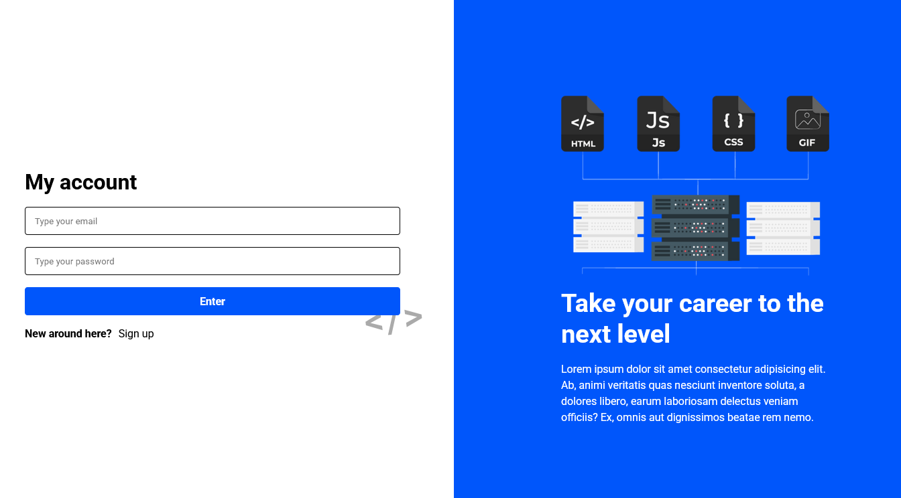
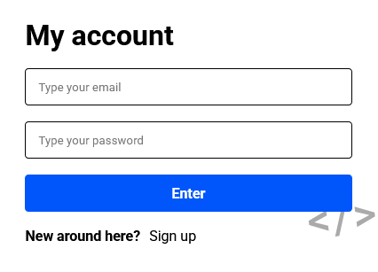

# Login-Page

Created with pure HTML5 and CSS3 with the main focus on the latter and explanations on most lines of the css file

To test it for yourself, download the files and run either the index or the sign up page

## Responsivity

Both pages are responsive

